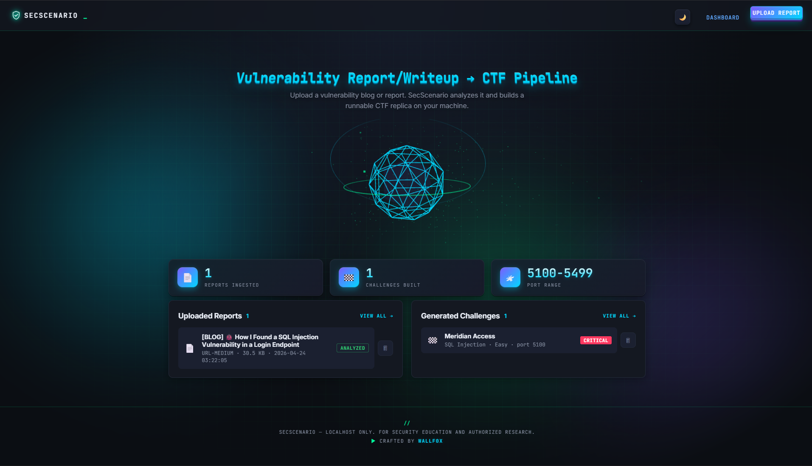

# SecScenario

Tool that turns vulnerability reports/blogs into runnable CTF challenges. Runs **either locally with Python** or **inside Docker** — both modes are first-class and can even run side-by-side on the same machine.

**Pipeline:** Upload report → Claude analyzes the vulnerability → Claude generates a minimal Flask web app that faithfully reproduces it → you exploit it to retrieve the flag.

> **Scope:** For personal security education and authorized research. Don't expose SecScenario or its generated challenges to the public internet.

---

## Dashboard



---

## Choose your run mode

| | Local (Python) | Docker |
|---|---|---|
| UI URL | http://localhost:5000 | http://localhost:8000 |
| Challenge ports | 5100–5500 | 6100–6500 |
| Data folder | `instance/`, `uploads/`, `challenges/` | `docker-data/instance/`, `docker-data/uploads/`, `docker-data/challenges/` |
| Best for | quick iteration, debugging | clean isolated environment, sharing setup |

The two modes use different ports and different data folders, so you can run **both at once** if you want.

---

## Option 1 — Run locally

### Prerequisites
- Python 3.10+ (tested on 3.13)
- An Anthropic API key with credits — get one at https://console.anthropic.com/settings/keys

### Steps

```bash
# 1. Clone / enter the project
cd SecScenario

# 2. (Recommended) create a virtual environment
python -m venv .venv
# Windows
.venv\Scripts\activate
# macOS / Linux
source .venv/bin/activate

# 3. Install dependencies
pip install -r requirements.txt

# 4. Configure your API key
#    Copy .env.example → .env and fill in your real key
copy .env.example .env       # Windows
cp .env.example .env         # macOS / Linux

# 5. Run the app
python app.py

# 6. Open the dashboard
#    http://127.0.0.1:5000
```

Stop the server with `Ctrl+C`.

---

## Option 2 — Run with Docker

### Prerequisites
- Docker Desktop (Windows / macOS) or Docker Engine + Compose plugin (Linux)
- The same `.env` file (containing your `ANTHROPIC_API_KEY`)

### Steps

```bash
# 1. Make sure Docker is running
docker --version
docker compose version

# 2. Make sure .env exists in the project root (same as Local mode)
#    If you don't have one yet:
cp .env.example .env         # macOS / Linux
copy .env.example .env       # Windows

# 3. Build and start the container
docker compose up --build -d

# 4. Open the dashboard
#    http://localhost:8000
```

### Useful Docker commands

```bash
docker compose ps                  # show container status
docker compose logs -f             # tail logs (Ctrl+C to detach)
docker compose restart             # restart after code/env changes
docker compose down                # stop and remove the container
docker compose down -v             # also remove the bind volumes
docker compose up --build -d       # rebuild after Dockerfile changes
```

### Linux note (`permission denied on /var/run/docker.sock`)

Either prefix commands with `sudo`, or add your user to the `docker` group once:

```bash
sudo usermod -aG docker $USER
newgrp docker        # apply the new group in the current shell
```

---

## Running both modes simultaneously

You can keep `python app.py` running on `http://localhost:5000` **and** `docker compose up -d` running on `http://localhost:8000` at the same time. They:

- bind to different host ports (`5000` vs `8000` for the UI, `5100-5500` vs `6100-6500` for challenges),
- write to different data folders (`instance/`, `uploads/`, `challenges/` vs `docker-data/...`).

Useful for, e.g., editing code locally while a clean reference instance runs in Docker.

---

## Running a generated challenge

Each generated challenge is self-contained Flask code in its own folder. The dashboard launches it for you, but you can also run it manually:

```bash
cd challenges/<name>_<port>     # or docker-data/challenges/<name>_<port>
pip install -r requirements.txt
python app.py
```

Then open `http://127.0.0.1:<port>`. `SOLUTION.md` in each challenge folder documents the intended solve.

---

## Project layout

```
SecScenario/
├── app.py                 # Flask entrypoint + routes
├── config.py              # Env-driven configuration
├── database.py            # SQLite models / queries
├── extractor.py           # PDF / MD / HTML / ZIP → plain text
├── analyzer.py            # Claude call #1 — vulnerability analysis
├── challenge_generator.py # Claude call #2 — challenge materialization
├── runner.py              # Spawns / supervises challenge subprocesses
├── templates/             # Jinja2 pages
├── static/                # CSS + JS
├── Dockerfile             # Container image
├── docker-compose.yml     # Compose service
├── .env.example           # Template for your secrets
├── docs/                  # Screenshots referenced in this README
├── uploads/               # (gitignored) uploaded reports — local mode
├── challenges/            # (gitignored) generated CTF apps — local mode
├── docker-data/           # (gitignored) all persistent data — Docker mode
└── instance/              # (gitignored) SQLite DB — local mode
```

---

## Configuration reference (`.env`)

| Variable | Default | Notes |
|---|---|---|
| `ANTHROPIC_API_KEY` | — | Required. |
| `FLASK_SECRET_KEY` | `dev-only-change-me` | Set this to a long random string. |
| `FLASK_HOST` | `127.0.0.1` (local), `0.0.0.0` (Docker) | Compose overrides this for containers. |
| `FLASK_PORT` | `5000` | Internal port; Docker maps it to host `8000`. |
| `FLASK_DEBUG` | `1` (local), `0` (Docker) | |
| `CLAUDE_MODEL` | `claude-sonnet-4-6` | |
| `CHALLENGE_HOST` | unset (local), `0.0.0.0` (Docker) | When set, generated challenges bind to this host so Docker can publish them. |
| `CHALLENGE_PORT_BASE` | `5100` (local), `6100` (Docker) | Lower bound of the challenge port pool. |
| `CHALLENGE_PORT_END` | `5500` (local), `6500` (Docker) | Upper bound (exclusive). |

---

## Troubleshooting

- **"credit balance is too low"** — add billing at console.anthropic.com.
- **"ANTHROPIC_API_KEY is missing"** — check `.env` has a real key (not the placeholder).
- **Upload fails (413)** — file exceeds 100 MB. Adjust `MAX_CONTENT_LENGTH` in `config.py`.
- **Port already in use (5000)** — another process is on 5000; change `FLASK_PORT` in `.env`, or use Docker mode (port 8000).
- **Firefox: "This address is restricted"** — port 6000 is blocked by browsers (X11). Docker mode uses 8000 by default.
- **Docker build fails on `lxml` / `psutil`** — rebuild with `docker compose build --no-cache`. The Dockerfile already pulls `build-essential` for fallback compilation.
- **Linux: `permission denied on docker.sock`** — see the Linux note in the Docker section.

---

## Security notes

- Local mode binds only to `127.0.0.1` by default. Don't change this unless you know what you're doing.
- Generated challenges contain **intentionally vulnerable code**. Run them only on a host you control.
- Uploaded files are saved unmodified under `uploads/`. Don't upload data you wouldn't otherwise trust on disk.
- The Anthropic API key lives in `.env` which is gitignored. Never commit `.env`.
